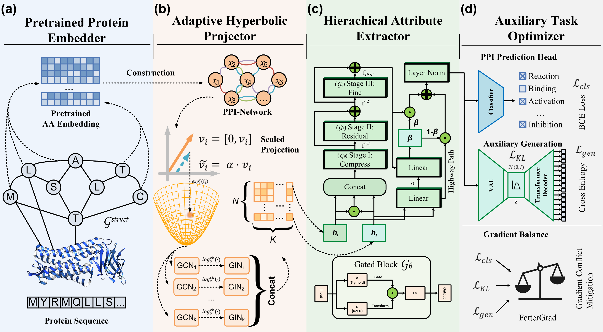

# ***REFLEX***

This repo is the implementation of our paper entitled [REFLEX: Modeling Dynamic Protein Flexibility for Interaction Prediction via Generative Regularization](https://github.com/HuaiwuZhang/REFLEX).

In this study, we designed a novel deep learning framework ***REFLEX*** (**RE**gularized **FLEX**ible protein interaction modeling) for protein-protein interaction (PPI) prediction. ***REFLEX*** addresses the challenge that proteins exhibit significant structural flexibility upon binding—ranging from small side-chain adjustments to large-scale domain movements—which existing rigid-body methods fail to capture. Through a multi-scale architecture and a biological consistency constraint, ***REFLEX*** consistently outperforms state-of-the-art methods across comprehensive benchmarks.

## Framework Overview



The pipeline of ***REFLEX*** primarily consists of four main components:

- **(a)** ***Pretrained Protein Embedder*** leverages a codebook pretrained on the STRING database to provide rapid and efficient representation of single-protein sequence and structure information;
- **(b)** ***Adaptive Hyperbolic Projector*** projects PPI networks onto a Lorentz hyperbolic manifold, preserving the inherent hierarchy through multi-view graph convolution and tangent space refinement;
- **(c)** ***Hierarchical Attribute Extractor*** employs a three-stage gating mechanism to progressively integrate interaction features, dynamically synthesizing information across varying spatial and energetic scales;
- **(d)** ***Auxiliary Generation Regularization*** incorporates an auxiliary sequence generation task that regularizes feature representations to mitigate fine-grained semantic loss resulting from deep feature transformation.

## Step-by-Step Guide for Running ***REFLEX***

### Clone the Repository

```bash
git clone https://github.com/HuaiwuZhang/REFLEX.git
cd REFLEX
```

### Prepare the Dataset

Download the dataset from [Hugging Face](https://huggingface.co/datasets/Huaiwu/REFLEX/tree/main) and place it in the following structure:

```
📂 REFLEX
├── 📄 main.py
├── 📁 models
│   ├── 📄 REFLEX.py
│   └── 📄 PPIGEN.py
├── 📁 src
│   ├── 📁 base
│   │   ├── 📄 trainer.py
│   │   └── 📄 model.py
│   ├── 📁 utilss
│   │   ├── 📄 logging.py
│   │   └── 📄 metrics.py
│   ├── 📄 ppi_data.py
│   ├── 📄 FetterGrad.py
│   ├── 📄 mainfold.py
│   ├── 📄 math_utils.py
│   ├── 📄 embedding.py
│   ├── 📄 utils.py
│   ├── 📄 models.py
│   ├── 📄 sequence_comparator.py
│   ├── 📄 vae_model.ckpt
│   └── 📄 param_configs.json
└── 📁 data
    ├── 📄 27K.txt
    ├── 📄 148K.txt
    ├── 📄 protein.SHS27k.sequences.dictionary.tsv
    ├── 📄 protein.SHS148k.sequences.dictionary.tsv
    ├── 📄 protein.actions.SHS27k.STRING.txt
    ├── 📄 protein.actions.SHS148k.STRING.txt
    ├── 📁 27K
    │   ├── 📄 27K_node.pt
    │   ├── 📄 27K_edge.pt
    │   ├── 📄 27K_kneg.pt
    │   └── 📄 27K_esm_embed.pt
    └── 📁 148K
        ├── 📄 148K_node.pt
        ├── 📄 148K_edge.pt
        ├── 📄 148K_kneg.pt
        └── 📄 148K_esm_embed.pt
```

### Create and Activate a New Environment

```bash
conda create -n reflex python=3.9 -y
conda activate reflex
```

### Install Dependencies

```bash
pip install torch torchvision torchaudio --index-url https://download.pytorch.org/whl/cu118
pip install torch-geometric
pip install fair-esm
pip install wandb pandas numpy tqdm scikit-learn
```

### (Optional) Weights & Biases

If you want to enable [Weights & Biases](https://wandb.ai/site/) logging:

```bash
wandb login
```

Add your wandb key in `main.py`:

```python
wandb.login(key="<your-wandb-key>")
```

### Model Training

**Example 1**: Training ***REFLEX*** on SHS27K with random split.

```bash
python main.py --dataset SHS27k --split_type random --n_exp 1
```

**Example 2**: Training ***REFLEX*** on SHS148K with BFS split.

```bash
python main.py --dataset SHS148k --split_type bfs --n_exp 1
```

**Example 3**: Training ***REFLEX*** on SHS27K with DFS split, using a specific random seed.

```bash
python main.py --dataset SHS27k --split_type dfs --split_seed 42 --torch_seed 42 --n_exp 1
```

**Example 4**: Ablation study — disable the Hierarchical Attribute Extractor (HAE).

```bash
python main.py --dataset SHS27k --split_type random --ablation_no_fusion True --n_exp 1
```

**Example 5**: Ablation study — disable the Auxiliary Generation Regularization (GEN).

```bash
python main.py --dataset SHS27k --split_type random --ablation_no_generation True --n_exp 1
```

**Example 6**: Training without wandb logging.

```bash
python main.py --dataset SHS27k --split_type random --wandb False --n_exp 1
```

## Folder Structure

We list the code of the major modules as follows:

1. The main function to train/test the model: [main.py](main.py)
2. The source code of the REFLEX model: [models/REFLEX.py](models/REFLEX.py)
3. The trainer: [src/base/trainer.py](src/base/trainer.py)
4. Data preparation and preprocessing: [src/ppi_data.py](src/ppi_data.py)
5. FetterGrad multi-task optimizer: [src/FetterGrad.py](src/FetterGrad.py)
6. Hyperbolic manifold operations: [src/mainfold.py](src/mainfold.py)

## Arguments

We introduce the major arguments of our main function here.

| Argument | Type | Default | Description |
|---|---|---|---|
| `--dataset` | str | `SHS27k` | Dataset name (`SHS27k` or `SHS148k`) |
| `--split_type` | str | `random` | Data splitting strategy (`random`, `bfs`, or `dfs`) |
| `--split_seed` | int | `42` | Random seed for data splitting |
| `--torch_seed` | int | `42` | Random seed for model parameters |
| `--batch_size` | int | `256` | Training batch size |
| `--model` | str | `REFLEX` | Model name |
| `--base_lr` | float | `0.0001` | Learning rate |
| `--lr_decay_ratio` | float | `0.5` | Learning rate decay ratio |
| `--max_grad_norm` | float | `5.0` | Maximum gradient norm for clipping |
| `--max_epochs` | int | `500` | Maximum number of training epochs |
| `--patience` | int | `25` | Early stopping patience |
| `--n_exp` | int | `1` | Experiment index |
| `--wandb` | bool | `True` | Whether to enable Weights & Biases logging |
| `--ln` | int | `2` | Number of graph convolution layers |
| `--protein_max_length` | int | `100` | Maximum protein sequence length for generation |
| `--lm_weight` | float | `5.0` | Weight for generation loss |
| `--kl_weight` | float | `1.0` | Weight for KL divergence loss |
| `--ablation_no_fusion` | bool | `False` | Ablation: disable Hierarchical Attribute Extractor |
| `--ablation_no_generation` | bool | `False` | Ablation: disable Auxiliary Generation Regularization |

## Acknowledgement

We referenced the model architecture and training framework from [HI-PPI](https://github.com/ttan6729/HI-PPI) and [MAPE-PPI](https://github.com/LirongWu/MAPE-PPI). The multi-task gradient harmonization is based on [FetterGrad](https://github.com/CSUBioGroup/DeepDTAGen). Thanks for your elegant code!

## Citation

If you find our work useful in your research, please cite:

```bibtex

```
